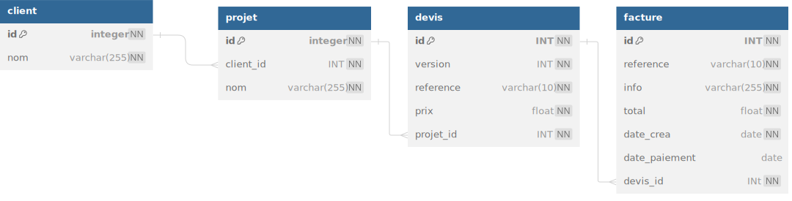

# Diagram



# la structure
```mysql
CREATE TABLE client(
    id int AUTO_INCREMENT PRIMARY KEY,
    nom varchar(255) not null 
)
ENGINE=InnoDB;
CREATE TABLE projet(
    id int AUTO_INCREMENT PRIMARY KEY,
    client_id int not null,
    nom varchar(255) not null,
    FOREIGN KEY(client_id) REFERENCES client(id)
)
ENGINE=InnoDB;
CREATE TABLE devis(
    id int AUTO_INCREMENT PRIMARY KEY,
    version int not null,
    reference varchar(10) not null,
    prix float not null,
    projet_id int not null,
    FOREIGN KEY(projet_id) REFERENCES projet(id)
ENGINE=InnoDB
)
CREATE TABLE facture(
    id int AUTO_INCREMENT PRIMARY KEY,
    reference varchar(10) not null,
    info varchar(255) not null,
    total float not null,
    date_crea date not null,
    date_paiement date,
    devis_id int not null,
    FOREIGN KEY(devis_id) REFERENCES devis(id)
)
ENGINE=InnoDB
```

# les datas
DELETE FROM client;
DELETE FROM projet;
DELETE FROM devis;
DELETE FROM facture;

INSERT INTO client (nom) VALUES 
	('Mairie de Rennes'),
	('Neo Soft'),
	('Sopra'),
	('Accenture'),
	('Amazon');

INSERT INTO projet (nom, client_id) VALUES
	('Création de site internet', 1),
	('Creationde site internet', 1),
	('Logiciel CRM', 2),
	('Logiciel de devis', 3),
	('Site internet e-commerce', 4),
	('Logiciel ERP', 2),
	('Logicielgestion de stock',4);

    
INSERT INTO devis (version,reference, prix, projet_id) VALUES
	('1','DEV2100A', 3000, 1),
	('2','DEV2100B', 5000, 2),
	('1','DEV2100C', 5000, 3),
	('1','DEV2100D', 3000, 4),
	('1','DEV2100E', 5000, 5),
	('1','DEV2100F', 2000, 6),
	('1','DEV2100G', 1000, 7);

INSERT INTO facture (reference,info,total,devis_id,date_crea,date_paiement)	
    VALUES
	('FA001', 'site internet partie 1', 1500, 1, '2023-09-01','2023-10-01'),
	('FA002', 'site internet partie 2', 1500, 1, '2023-09-20',null),
	('FA003', 'logiciel CRM', 5000, 2, '2024-02-01',null),
	('FA004', 'logiciel devis', 3000, 3, '2024-03-03','2024-04-03'),
	('FA005', 'site ecommerce', 5000, 4, '2024-04-01',null),
	('FA006', 'logiciel ERP', 2000, 2, '2024-04-01',null);

# les questions


--1 - Afficher toutes les factures avec le nom des clients

SELECT client.nom, facture.reference FROM client 
INNER JOIN projet ON client.id = projet.client_id
INNER JOIN devis ON projet.id = devis.projet_id
INNER JOIN facture ON devis.id = facture.devis_id;


--2 - Afficher le nombre de factures par client afficher 0 factures si il n'y a pas de factures

SELECT client.nom, COUNT(facture.reference) FROM client
LEFT JOIN projet ON client.id = projet.client_id
LEFT JOIN devis ON projet.id = devis.projet_id
LEFT JOIN facture ON devis.id = facture.devis_id
GROUP BY client.nom;


--3 - afficher le chiffre d'affaire par client

SELECT client.nom, SUM(facture.total) FROM client
JOIN projet ON client.id = projet.client_id
JOIN devis on projet.id = devis.projet_id
JOIN facture ON devis.id = facture.devis_id
GROUP BY client.nom;


--4 - afficher le CA total

Select SUM(facture.total) FROM client
JOIN projet ON client.id = projet.client_id
JOIN devis on projet.id = devis.projet_id
JOIN facture ON devis.id = facture.devis_id


--5 - afficher la somme des factures en attente de paiement

SELECT SUM(facture.total) FROM client
JOIN projet ON client.id = projet.client_id
JOIN devis on projet.id = devis.projet_id
JOIN facture ON devis.id = facture.devis_id
WHERE facture.date_paiement IS NULL;


--6 - afficher les factures en retard de paiment 30 jours max avec le nombre de jours de retard

SELECT facture.reference , DATEDIFF(curdate(), facture.date_crea)  as jours

FROM client
JOIN projet ON client.id = projet.client_id
JOIN devis on projet.id = devis.projet_id
JOIN facture ON devis.id = facture.devis_id
where facture.date_paiement IS NULL 
OR DAY(facture.date_paiement) > 30;